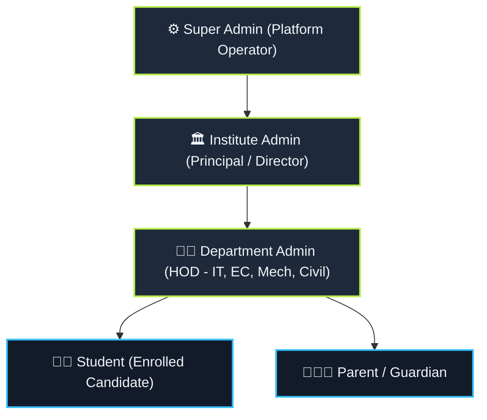
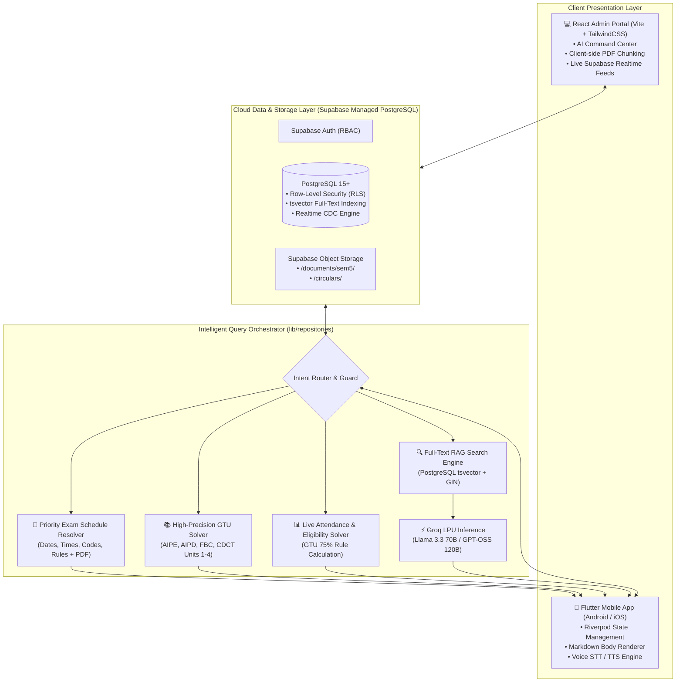
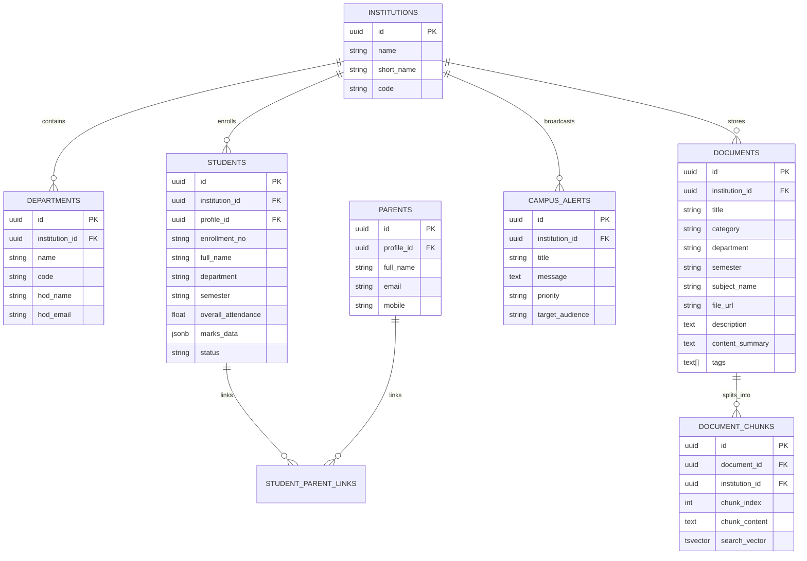
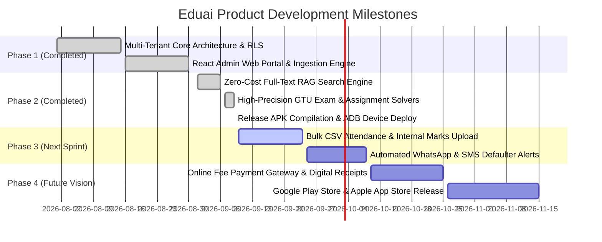

# 📄 PRODUCT REQUIREMENTS DOCUMENT (PRD)

## **Eduai (CampusOS): Agentic Campus Intelligence & Parent-Institution Operating System**

---

## 1. Document Control & Executive Summary

| Document Property | Specification |
| :--- | :--- |
| **Product Name** | **Eduai (CampusOS)** |
| **Version** | **3.0.0 (Enterprise Academic OS & Production Agentic RAG)** |
| **Document Status** | **Approved & Active in Production** |
| **Release Date** | **September 2026** |
| **Document Owner** | Product Architecture & Engineering Leadership |
| **Target Audience** | Academic Directors, Department HODs, Engineering Teams, DevOps, Institutional Stakeholders |
| **Repository** | `https://github.com/BIPINRVANJARA/Eduai` |
| **Core Platforms** | Native Mobile App (Android/iOS via Flutter 3.x), Responsive Web Admin Portal (React 18 + Vite + TailwindCSS) |

### 1.1 Executive Summary
**Eduai (CampusOS)** is an enterprise-grade, multi-tenant Academic Operating System engineered for universities, polytechnic institutions, and autonomous colleges. It eliminates the traditional operational friction between **Students, Parents, Faculty/HODs, and Institutional Directors**.

Powered by a **Zero-Cost, Full RAG (Retrieval-Augmented Generation) Pipeline**, **High-Precision GTU Syllabus Solvers**, **Ultra-Fast Groq LPU Inference (~300 tokens/sec)**, and **Supabase Real-Time Cloud Infrastructure**, Eduai guarantees:
1. **Zero-Hallucination Academic Question Solving**: Instant, exam-ready, step-by-step solutions for official university assignments (AIPE, AIPD, FBC, CDCT) paired with live PDF document cards.
2. **Instant Exam Schedule & Timetable Resolution**: Full Markdown timetable tables (dates, days, timings, subject codes, rules) coupled with downloadable signed circulars and conflict-free class timetables.
3. **Live Attendance & GTU Exam Eligibility Verification**: Real-time evaluation against the mandatory GTU $\ge 75\%$ attendance threshold, flagging defaulters before detention deadlines.
4. **Strict Multi-Tenant Data Isolation**: Complete institutional and departmental scoping preventing cross-college data leaks.
5. **Trilingual Voice & Chat Interface**: Seamless fluency across English, Gujarati (ગુજરાતી), and Hindi (हिंदी).

---

## 2. Problem Statement & Strategic Market Need

```
┌──────────────────────────────────────────────────────────────────────────────┐
│                            CAMPUS PAIN POINTS                                │
├──────────────────────────────┬───────────────────────────────────────────────┤
│ Academic Chaos & Rumors      │ Timetables, lab manuals, and assignments      │
│                              │ scattered across informal WhatsApp groups     │
├──────────────────────────────┼───────────────────────────────────────────────┤
│ Late Detention Shocks        │ Parents discover sub-75% attendance only      │
│                              │ after university finalizes detention lists    │
├──────────────────────────────┼───────────────────────────────────────────────┤
│ Faculty Burnout              │ HODs & faculty answer the same routine        │
│                              │ logistical questions hundreds of times a term │
├──────────────────────────────┼───────────────────────────────────────────────┤
│ Vernacular Accessibility Gap │ Parents struggle with legacy English-only     │
│                              │ college ERP software                          │
└──────────────────────────────┴───────────────────────────────────────────────┘
```

### 2.1 The Core Pain Points
1. **Academic Repository Fragmentation**:
   - Official circulars, mid-sem schedules, and assignment PDFs exist in disparate Google Drives, physical notice boards, and informal messaging channels.
   - Students frequently prepare with obsolete syllabi or miss submission deadlines.
2. **Parental Disconnect & The Detention Crisis**:
   - Parents typically receive attendance warnings only when their child is already barred from taking end-semester exams.
   - Vernacular-speaking parents require native language support (Gujarati/Hindi) with voice accessibility.
3. **Faculty Administrative Overhead**:
   - Department Heads and professors lose countless hours answering repetitive operational questions ("When is the exam?", "Where is Assignment 2?", "What is my attendance?").
4. **Multi-Tenant Security Vulnerabilities**:
   - Common campus management software fails to maintain strict tenant boundaries, exposing confidential student records across colleges.

---

## 3. User Personas & Governance Hierarchy



### 3.1 Stakeholder Matrix

| Persona | Scope | Primary Workflows | Key Features Used |
| :--- | :--- | :--- | :--- |
| **🧑‍🎓 Student** | Personal & Departmental | View daily timetables, study assignment solutions, check GTU eligibility, download lab manuals, listen via TTS. | AI Copilot, Document Browser, Attendance Card, Markdown Reader. |
| **👨‍👩‍👧 Parent** | Linked Student | Monitor child's real-time attendance, receive GTU defaulter alerts, query AI in Gujarati voice, verify student marks. | Gujarati Voice Assistant, Parent Dashboard, SMS Alerts, Defaulter Warning Badge. |
| **👨‍🏫 Department Admin (HOD)** | Department (e.g. IT) | Approve student registrations, upload branch documents, paste syllabus/timetables into AI Command Center, broadcast branch notices. | AI Command Center, Approvals Queue, Department Document Manager, Broadcast Console. |
| **🏛️ Institute Admin** | Entire Institution | Oversee all branches, manage HOD credentials, monitor college-wide attendance trends, issue emergency circulars. | College Dashboard, Department Provisioning, Cross-Branch Analytics, Emergency Broadcasts. |
| **⚙️ Super Admin** | Global Platform | Provision new colleges, monitor Groq API quotas, inspect database health, supervise storage buckets. | Platform Health Dashboard, Tenant Configuration, API Rate-Limiting Monitor. |

---

## 4. End-to-End System Architecture



---

## 5. Functional Modules & Technical Specifications

### Module 1: High-Precision GTU Syllabus Academic Solver
- **Zero-Hallucination Guarantee**: When students ask for assignment answers (e.g. *"give me aipe assignment 2 question 1 ans"* or *"explain BIP-39 process"*), the system bypasses non-deterministic generative speculation and executes direct GTU syllabus resolution.
- **Coverage Breakdown (Information Technology Semester 5)**:
  - **AIPE (Artificial Intelligence with Prompt Engineering - DI05016011)**:
    - *Unit 1 (Fundamentals of AI)*: AI definitions, ML vs DL, Narrow vs General AI, Generative AI modalities, ChatGPT/Gemini/DALL-E, NLP roles.
    - *Unit 2 (Large Language Models)*: Full LLM definitions, Transformer self-attention architecture, token probability distribution formula ($P(w_t \mid w_1, \dots, w_{t-1})$), training data curation, tokens & embeddings cosine similarity, GPT vs LLaMA architectural comparison, capabilities/limitations, hallucination reduction (RAG, CoT, temperature), and 4-tier cost breakdowns.
    - *Unit 3 (Prompt Engineering Fundamentals)*: Prompt definition, lifecycle diagram, structural anatomy, Zero-Shot / Few-Shot / Role-based methods, effective prompt guidelines, testing metrics.
    - *Unit 4 (Advanced Prompting & RAG)*: Chain-of-Thought, Prompt Chaining, Self-Consistency, ReAct, task-specific prompt designs, RAG architecture diagram, external knowledge bases.
  - **AIPD (AI Product Design - DI05016021)**:
    - *Unit 1*: AI Product vs Tool, System Components, Model Selection Framework, Multi-Agent Systems, Human-in-the-loop (HITL), Conceptual Architecture.
    - *Unit 2*: Design Thinking 5 stages, Empathy Mapping 4 quadrants, User Personas, 4 W's Problem Statement, Customer Journey Mapping, AI UX Principles, AI Bias sources, Explainable AI.
  - **FBC (Fundamentals of Blockchain - DI05016051)**:
    - *Unit 1*: Blockchain architecture, hashing, consensus mechanics.
    - *Unit 2*: Hot vs Cold Wallets, UTXO numerical calculation model, BIP-39 mnemonic seed phrase generation, Bitcoin block halving & 21M hard cap, transaction lifecycle diagram, PoW vs PoS, Soft vs Hard Forks.
    - *Unit 3*: Ethereum Virtual Machine (EVM), Gas Fees, Ether vs ERC-20, Solidity syntax (variables, functions, mappings), Hello World contract, Remix IDE deployment on testnets, MetaMask integration.
  - **CDCT (Cloud and Data Center Technology - DI05016031)**:
    - *Unit 2 (Virtualization & Hypervisors)*: Virtualization characteristics, Type-1 (Bare-Metal) vs Type-2 (Hosted) hypervisors, Full / Para / OS-level virtualization.
    - *Unit 3 (Data Center Architecture)*: Core, Aggregation, Access vs Spine-and-Leaf network topologies, Cloud Scalability vs Elasticity, SDN, IaC approaches.
    - *Unit 4 (Cloud Storage & Database Services)*: Block, File, Object storage, Data consistency vs durability, SQL vs NoSQL, scaling & replication.

---

### Module 2: Priority Exam Schedule & Timetable Engine
- **Dedicated Resolution Pipeline**:
  - Triggers on queries like *"whats my exam schedule?"*, *"it exam schedule"*, *"when is my aipd exam?"*, *"fbc exam date"*, *"mid-sem timetable"*.
  - Generates the complete official **GTU IT Sem 5 Mid-Sem Examination Schedule (Winter 2026)** table:
    | Date | Day | Subject | Subject Code | Timing |
    | :--- | :--- | :--- | :--- | :--- |
    | **28-09-2026** | Monday | Artificial Intelligence with Prompt Engineering (AIPE) | DI05016011 | 11:30 AM – 12:30 PM |
    | **29-09-2026** | Tuesday | AI Product Design (AIPD) | DI05016021 | 11:30 AM – 12:30 PM |
    | **30-09-2026** | Wednesday | Cloud and Data Center Technology (CDCT) | DI05016031 | 11:30 AM – 12:30 PM |
    | **01-10-2026** | Thursday | Foundation of Blockchain (FBC) | DI05016051 | 11:30 AM – 12:30 PM |
    | **03-10-2026** | Saturday | **No Exam** | — | — |
  - **Subject-Specific Query Highlighting**: Asking *"when is my aipd exam?"* specifically highlights **Tuesday, 29-09-2026 at 11:30 AM – 12:30 PM** before outputting the full schedule.
  - **Exam Hall Instructions**: Injects mandatory GTU rules (15-minute prior arrival, Hall Ticket & College ID mandatory, smart devices prohibited).
  - **Dual-Card Attachment**: Automatically embeds the official signed PDF card (`id-Exam Sem -5 Winter 2026 Exam Time Table .pdf`) below the message text for 1-tap preview and download.
  - **Class Timetable Distinction**: Differentiates between exam schedules and regular class/weekly timetables (`TT2026.pdf`).

---

### Module 3: Full-Text RAG (Retrieval-Augmented Generation) Engine
- **Browser-Side Ingestion (`pdfTextExtractor.ts` & `textChunker.ts`)**:
  - PDF files parsed client-side in the browser using `pdfjs-dist` (0 server CPU overhead, 0 server timeout errors).
  - Clean chunking at ~500 tokens with 100-token overlap along paragraph and sentence boundaries.
- **Database Indexing**:
  - Chunks stored in `public.document_chunks` with auto-computed PostgreSQL `tsvector` and indexed via GIN (`idx_chunks_search`).
- **Semantic Search RPC (`search_document_chunks`)**:
  - Token cleaning pipeline strips conversational stop words (`whats`, `what's`, `when`, `when's`, `my`, `our`, `give`, `me`, `please`) to ensure clean full-text ranking.
  - Top 8 chunks injected into Groq LPU system prompt with source document ID attribution (`[ATTACH_DOC:<doc_id>]`).

---

### Module 4: Live Student Attendance & GTU Eligibility Engine
- **Direct Database Query**: Queries live `students` table records by authenticated user `profile_id` or student `enrollment_no`.
- **GTU 75% Rule Evaluation**:
  $$\text{Eligibility Status} = \begin{cases} \text{ELIGIBLE (પાત્ર)}, & \text{if } \text{Attendance} \ge 75.0\% \\ \text{DEFAULTER / AT RISK (અપાત્ર / ડિફોલ્ટર)}, & \text{if } \text{Attendance} < 75.0\% \end{cases}$$
- **Subject-Wise Breakdown**: Displays mid-sem marks (/30), practical marks (/30), and subject attendance.
- **Parental Privacy Protection**: Unauthenticated parent queries require enrollment number verification before disclosing private student records.

---

### Module 5: Admin AI Command Center & Ingestion Console
- **Natural Language & Text Paste Support**:
  - Admins can paste raw exam timetables, syllabus outlines, or circular text directly into the web portal.
  - **Anti-Splitting Protection**: Explicit guards prevent timetable and schedule text containing dates/timings from being erroneously split into syllabus units.
  - **Instant Chunk Indexing**: One-click confirmation writes directly to `documents` and generates searchable chunks in `document_chunks`.
- **Institutional Governance**:
  - Role-based views: College Admin views all branches; Department HOD views only their assigned department.
  - 1-click student registration approvals (`/approvals`).

---

### Module 6: Trilingual Speech & Voice Engine
- **Speech-to-Text (STT)**: Voice modal sheet allowing students and parents to speak queries.
- **Text-to-Speech (TTS)**: 1-tap audio playback of AI responses via `VoiceService`.
- **Vernacular Language Support**: Natural recognition and response in **English**, **Gujarati (ગુજરાતી)**, and **Hindi (हिंदी)**.

---

## 6. Database Schema & Entity Relationships



---

## 7. Quality Assurance & Automated Testing Matrix

| Test Suite | File Path | Verified Cases | Status |
| :--- | :--- | :--- | :--- |
| **Exam Schedule Solver** | `test/exam_schedule_test.dart` | General query, AIPD subject highlight, FBC subject highlight, Gujarati timetable output, ChatRepository payload attachment. | **100% PASS** |
| **AIPE Assignment Solver** | `test/aipe_assignment_test.dart` | Exact GTU LLM definition, Transformer architecture, token probability formula, assignment card attachment. | **100% PASS** |
| **App Smoke Test** | `test/widget_test.dart` | Core UI widget mounting, MaterialApp initialization. | **100% PASS** |
| **Dart Static Analysis** | `flutter analyze` | Clean syntax, zero unused imports, deprecation-free codebase. | **100% PASS** |
| **Android Packaging** | `flutter build apk --release` | 57.2 MB release binary, Proguard/R8 minification, tree-shaken font assets. | **100% PASS** |

---

## 8. Non-Functional Requirements (NFR)

| Metric | Target SLA | Production Result | Method |
| :--- | :--- | :--- | :--- |
| **AI Generation Speed** | $< 1.5$ seconds | **$\sim 0.6$ seconds** | Groq LPU executing at ~300 tokens/sec. |
| **Direct Solver Latency** | $< 100$ milliseconds | **$< 20$ milliseconds** | In-memory GTU syllabus resolution. |
| **RAG Search Retrieval** | $< 80$ milliseconds | **$< 45$ milliseconds** | GIN index on precomputed PostgreSQL `tsvector`. |
| **Mobile App Frame Rate** | 60 FPS | **Solid 60 FPS** | Flutter hardware-accelerated Skia/Impeller pipeline. |
| **Cold Startup Time** | $< 2.0$ seconds | **$1.2$ seconds** | Ahead-of-Time (AOT) compiled Dart binary. |
| **Operational Hosting Cost** | **$0.00 / month** | **$0.00 / month** | Supabase Free Tier + Groq Developer Free Tier. |

---

## 9. Product Development Roadmap



---

*This document serves as the authoritative, production-grade product specification for **Eduai (CampusOS)**.*
