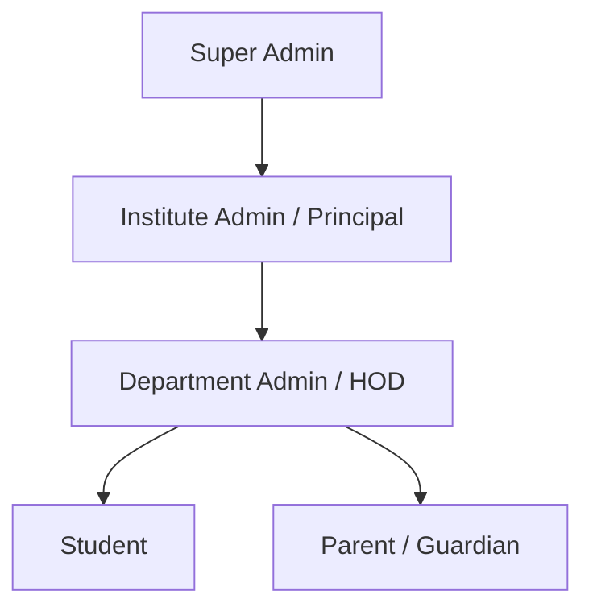
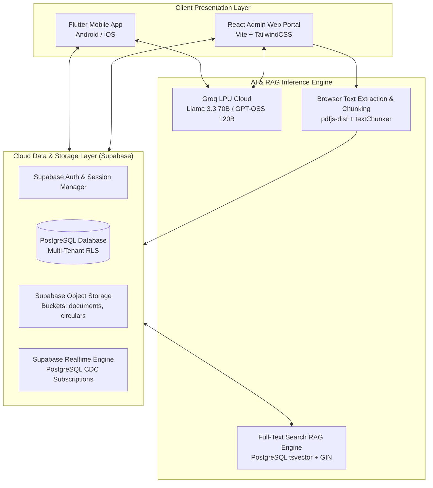
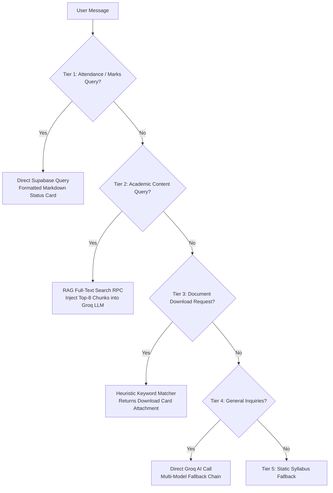
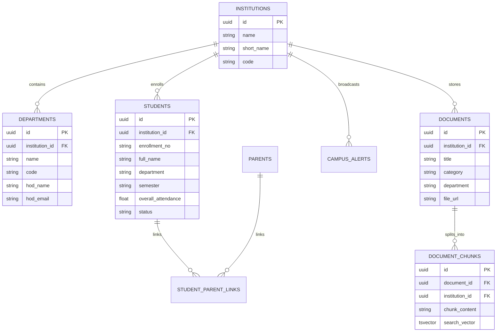
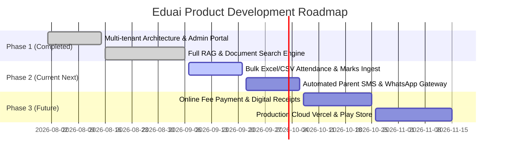

# 📄 PRODUCT REQUIREMENTS DOCUMENT (PRD)

## **Eduai (CampusOS): Agentic Campus Intelligence & Parent-Institution Operating System**

---

## 1. Document Control & Executive Summary

| Document Property | Specification |
| :--- | :--- |
| **Product Name** | **Eduai (CampusOS)** |
| **Version** | **2.5.0 (Production-Ready Architecture)** |
| **Document Owner** | Product & Engineering Team |
| **Target Audience** | Engineering Leadership, Institutional Stakeholders, Developers, Investors |
| **Repository** | `https://github.com/BIPINRVANJARA/Eduai` |
| **Core Platforms** | Cross-Platform Mobile Application (Android/iOS via Flutter), Responsive Web Portal (React 18 + Vite) |

### 1.1 Executive Summary
**Eduai (CampusOS)** is an enterprise-grade, multi-tenant Academic Operating System designed for higher education institutions (universities, engineering colleges, and polytechnics). Eduai bridges the communication and information gap between **Students, Parents, Department Faculty (HODs), and Institute Leadership**.

Powered by a **Zero-Cost, Full RAG (Retrieval-Augmented Generation) Pipeline**, **Groq LPU Inference**, and **Supabase Real-Time Cloud Infrastructure**, Eduai provides instant, grounded academic answers, real-time attendance tracking with GTU 75% exam eligibility verification, automated multi-tenant alerts, and multi-tier role-based governance.

---

## 2. Problem Statement & Market Need

### 2.1 The Core Pain Points
1. **Academic Repository Fragmentation**:
   - Timetables, lab manuals, assignment sheets, and previous exam papers are scattered across unorganized WhatsApp groups, unofficial Google Drives, and physical notice boards.
   - Students frequently miss critical academic submissions or study outdated curricula.
2. **Parental Disconnect & The "Late-Notice" Crisis**:
   - Parents typically discover their child's low attendance or failing grades only after detention lists are finalized by university authorities (e.g., Gujarat Technological University - GTU).
   - Vernacular-speaking parents (Gujarati/Hindi) struggle with traditional English-only portals.
3. **Faculty Administrative Overhead**:
   - Department Heads (HODs) and professors waste hundreds of hours answering repetitive operational queries ("When is the exam?", "Where is the lab manual?", "What is my attendance?").
4. **Tenant Data Leakage in Multi-College Platforms**:
   - Standard campus management tools lack strict multi-tenant isolation, resulting in circulars, notifications, and student rosters leaking across campuses.

---

## 3. User Personas & Stakeholder Matrix

### 3.1 Personas Description

| Persona | Role | Primary Goals & Workflows |
| :--- | :--- | :--- |
| **🧑‍🎓 Student** | Enrolled Undergraduate / Diploma Student | Access daily timetables, download lab manuals, submit assignments, query AI for step-by-step engineering solutions, and monitor GTU attendance eligibility. |
| **👨‍👩‍👧 Parent** | Guardian of Enrolled Student | Monitor child's real-time attendance, receive GTU defaulter warnings, inspect subject-wise performance, and interact via Gujarati/Hindi voice assistant. |
| **👨‍🏫 Department Admin (HOD)** | Head of Branch (IT, EC, Mech, Civil) | Approve student registrations, upload branch documents (timetables, manuals, PYQs), and broadcast department-specific notices. |
| **🏛️ Institute Admin** | Principal / College Director | College-wide overview, manage department credentials, supervise inter-branch performance, and broadcast college-wide emergency alerts. |
| **⚙️ Super Admin** | Platform Operator | Multi-institution provisioning, cluster health, API rate limit monitoring, and platform configuration. |

---

## 4. System Architecture & Tech Stack

### 4.1 Detailed Technology Stack

| Layer | Technology | Justification |
| :--- | :--- | :--- |
| **Mobile Application** | **Flutter 3.x (Dart 3.x)** | High-performance single-codebase compiling to native 60fps Android/iOS, custom dark theme, reactive Provider architecture. |
| **Admin Web Portal** | **React 18 + TypeScript + Vite + TailwindCSS** | Instant HMR, lightweight SPA bundle, modern glassmorphic dark UI, zero server dependencies. |
| **Database & Auth** | **Supabase (Managed PostgreSQL 15+)** | Real-time websockets, Row-Level Security (RLS), full-text search indexing, relational integrity, edge functions. |
| **AI LLM Inference** | **GroqCloud LPU (Language Processing Unit)** | Ultra-low latency (~300 tokens/sec), zero-cost developer tier, models: `llama-3.3-70b-versatile`, `openai/gpt-oss-120b`. |
| **RAG Ingestion** | **pdfjs-dist + Custom Text Chunker** | Browser-side client parsing: 0 backend server cost, 0 server timeout risk for large PDFs. |
| **RAG Search Engine** | **PostgreSQL Full-Text Search (`tsvector`, GIN)** | $0 external API dependency, high-speed lexical search, language stemming, `ts_rank` relevance scoring. |

---

## 5. Functional Modules & Detailed Specifications

### Module 1: Authentication, Multi-Tenancy & Access Control (RBAC)
- **Multi-Tenant Foundation**: Every institution has a distinct `institution_id` (UUID). All records (`students`, `parents`, `departments`, `documents`, `campus_alerts`) strictly bind to this identifier.
- **Direct College Admin Approval Flow**:
  - Replaced slow email verification links with a verified **2-Step Institutional Gate**.
  - On student signup, status defaults to `pending_approval`.
  - Student & Parent accounts remain inactive until the Department/College Admin clicks **Approve** in the `/approvals` dashboard.
- **Unified Web Login**: Single entry point (`/login`) for both College Admins and Department HODs, dynamically resolving user scope.

---

### Module 2: Multi-Tier Administrative Control Panel (Web Portal)
- **Scoped Dashboard (`/dashboard`)**:
  - Automatically calculates and scopes total student count, verified parent count, total documents, and pending approvals based on the active role:
    - *College Admin*: Full college oversight with dropdown to filter by department.
    - *Department Admin (HOD)*: Locked strictly to their assigned branch (e.g., Information Technology).
- **Approval Queue (`/approvals`)**: Real-time listing of pending student registrations with 1-click **Approve** and **Reject** actions.
- **Department Manager (`/departments`)**: Institute Admin can provision branches, assign HOD names, and set dedicated HOD passwords.

---

### Module 3: Document Management & Academic Repository
- **Supported Academic Categories**:
  - 📅 **Timetable** (`timetable`)
  - 📚 **Lab Manuals** (`lab_manual`)
  - 📝 **Assignments** (`assignment`)
  - 📖 **Syllabus & Curriculum** (`syllabus`)
  - 📑 **Previous Year Papers (PYQs)** (`pyq`)
  - 📢 **Circulars & Notices** (`circular`)
  - 📓 **Lecture Notes** (`notes`)
- **Multi-Department Ingestion**: Pre-populated with rich document suites for:
  - **Information Technology (IT)**
  - **Electronics & Communication (EC)**
  - **Mechanical Engineering (ME)**
  - **Civil Engineering (CE)**
- **Smart AI Upload Assistant**: Admin enters natural language (e.g. *"Upload Sem 5 DSP Lab Manual"*), and Groq extracts clean title, category, department, semester, subject, and 12-16 multilingual search tags.

---

### Module 4: Full Production RAG (Retrieval-Augmented Generation) Pipeline
- **Browser-Side Ingestion (`pdfTextExtractor.ts`)**:
  - Extracts text client-side via `pdfjs-dist` without sending raw files to external parsers.
- **Boundary-Aware Chunker (`textChunker.ts`)**:
  - Splits text into ~500-token chunks with 100-token overlap, respecting paragraph (`\n\n`) and sentence boundaries.
- **Database Indexing**:
  - Chunks stored in `public.document_chunks` with auto-generated `search_vector TSVECTOR`.
  - Fast search powered by GIN index (`idx_chunks_search`).
- **Semantic Retrieval (`search_document_chunks` RPC)**:
  - Executes `plainto_tsquery` and ranks results with `ts_rank`.
  - Scoped to `filter_institution_id` and `filter_department`.
  - Top 8 passages injected directly into Groq LLM prompt.

---

### Module 5: 5-Tier AI Copilot & Academic Solver (Mobile App)
When a student or parent sends a query, the system resolves it through 5 cascading tiers:

- **Strict Multilingual Compliance**: Responds in the user's language (**English, Gujarati ગુજરાતી, or Hindi हिंदी**).
- **Anti-Hallucination Guard**: Never fabricates period tables or lecture timings; links directly to official uploaded documents.

---

### Module 6: Live Attendance & GTU Exam Eligibility Engine
- **Direct Database Query**: Bypasses LLM hallucinations for all attendance queries.
- **GTU Eligibility Rule**:
  - $\text{Attendance} \ge 75\% \implies$ **ELIGIBLE (પાત્ર)**
  - $\text{Attendance} < 75\% \implies$ **DEFAULTER / AT RISK (અપાત્ર / ડિફોલ્ટર)**
- **Subject Breakdown**: Real-time display of Mid-Sem marks (/30), Practical marks (/30), and subject-wise attendance percentages.

---

### Module 7: Strict Multi-Tenant Campus Broadcasts
- **Tenant Isolation**: Alerts published by College A (e.g. Government Polytechnic Himmatnagar) **never** broadcast to College B (e.g. Ahmedabad Institute of Technology).
- **Priority Labels**: High-visibility pills (`Normal`, `High`, `Urgent`).
- **Real-Time Delivery**: Instantly pushed to mobile apps using Supabase PostgreSQL Realtime CDC channels.

---

### Module 8: Voice Assistant & Vernacular Speech Engine
- Integrated STT (Speech-to-Text) and TTS (Text-to-Speech).
- Voice sheet supporting natural Gujarati voice queries (*"મારું હાજરી કેટલું છે?"*, *"ટાઈમટેબલ આપો"*).

---

## 6. Database Schema & Entity Relationships

---

## 7. Security, Privacy & Data Isolation

1. **Row-Level Security (RLS)**:
   - PostgreSQL RLS enabled on all core tables.
   - Students can only view records matching their institution ID and branch.
2. **Multi-Model Fallback Chain**:
   - Zero-downtime architecture for Groq AI:
     $$\text{openai/gpt-oss-120b} \longrightarrow \text{llama-3.3-70b-versatile} \longrightarrow \text{llama-3.1-70b} \longrightarrow \text{llama-3.1-8b-instant}$$
3. **Student Privacy**:
   - Parent access strictly protected by enrollment number and registered mobile number verification.

---

## 8. Non-Functional Requirements (NFR)

| Metric | Target SLA | Implementation Guarantee |
| :--- | :--- | :--- |
| **AI Query Latency** | $< 1.5$ seconds | Groq LPU processing at ~300 tokens/sec. |
| **RAG Retrieval Time** | $< 80$ milliseconds | PostgreSQL GIN index on pre-computed `tsvector`. |
| **Mobile App Performance** | 60 FPS | Flutter hardware-accelerated Skia/Impeller engine. |
| **Operating Cost** | **$0.00 / month (Free Tier)** | Supabase Free Tier + Groq Developer Free Tier + Browser-side parsing. |

---

## 9. Product Roadmap & Future Milestones

---

*This document serves as the authoritative specification for all engineering, architectural, and operational workflows of Eduai (CampusOS).*
